# Projeto GCB


Projeto criado com Spring boot e Hibernate.

  - API REST
  - Requisição via Postman
  - Objetivo: Desenvolver um sistema que faça a gestão de cadastros de médicos


# Adicionando Doctor

  - Utilize o metodo POST
  
  - Utilizando a seguinte estrutura para adicionar como exemplo
  


 ```sh
{
    "phone": "1881818181",
    "name": "Murilo Pereira",
    "cep": "04119061",
    "crm": "0000000",
    "specialties": [{ "id": 1}, { "id": 3 }]
}
```

> Os IDS foram modificados para que consiga integrar caso passe para um front-end.
• ID 1 = ALERGOLOGIA
• ID 2 = ANGIOLOGIA
• ID 3 = BUCO MAXILO
• ID 4 = CARDIOLOGIA CLÍNICA
• ID 5 = CARDIOLOGIA INFANTIL
• ID 6 = CIRURGIA CABEÇA E PESCOÇO
• ID 7 = CIRURGIA CARDÍACA
• ID 8 = CIRURGIA DE TÓRAX
  

  - Enviando a requisição passando os parametros name, cep, crm, specialties
  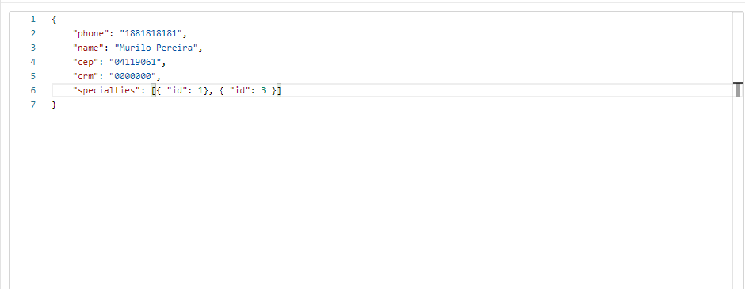

  - Resposta já recebendo as informações da API do correio em address, e também recebendo as especialidades com os IDS vinculados
  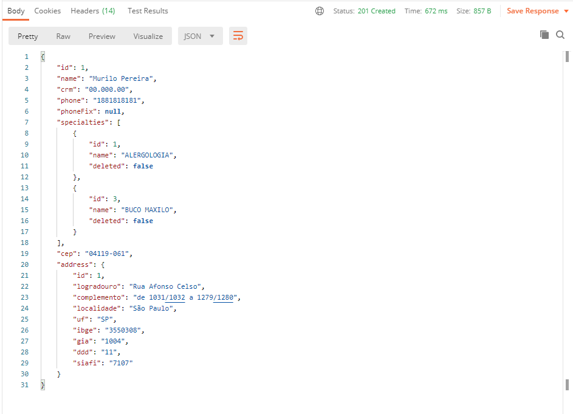
  


Implementações:
  - Formatar o CRM para o padrão 00.000.00
  - Formatar o CEP para o formato 00000-000
  - Implementar API do correio para vincular aos atributos do address
  - Criar tabela composta baseada nas especialidades por ID e nome;


# Buscando Doctor


Populando tabela

 ```sh
{
    "phone": "1881818181",
    "name": "Roberto Augusto",
    "cep": "04119061",
    "crm": "0000000",
    "specialties": [{ "id": 5}, { "id": 1 }]

    "phone": "1881818181",
    "name": "João Cleber",
    "cep": "04119061",
    "crm": "0000000",
    "specialties": [{ "id": 6}, { "id": 1 }]

    "phone": "1881818181",
    "name": "Renato Almeida",
    "cep": "04119061",
    "crm": "0000000",
    "specialties": [{ "id": 3}, { "id": 8 }]


    "phone": "1881818181",
    "name": "Isadora Pereira",
    "cep": "04119061",
    "crm": "0000000",
    "specialties": [{ "id": 4}, { "id": 5 }]
}
```

Após popular o banco, você consegue listar todas as informações adicionadas utilizando GET requisitando /doctors

- Enviando a requisição para GET
- Aceita parametros de pesquisa como http://localhost:8080/doctors/search?name=Murilo Pereira&phone=1818181818
- Resposta

```sh
[
    {
        "id": 1,
        "name": "Murilo Pereira",
        "crm": "00.000.00",
        "phone": "1881818181",
        "phoneFix": null,
        "specialties": [
            {
                "id": 1,
                "name": "ALERGOLOGIA",
                "deleted": false
            },
            {
                "id": 3,
                "name": "BUCO MAXILO",
                "deleted": false
            }
        ],
        "cep": "04119-061",
        "address": {
            "id": 1,
            "logradouro": "Rua Afonso Celso",
            "complemento": "de 1031/1032 a 1279/1280",
            "localidade": "São Paulo",
            "uf": "SP",
            "ibge": "3550308",
            "gia": "1004",
            "ddd": "11",
            "siafi": "7107"
        }
    },
    {
        "id": 2,
        "name": "Roberto Augusto",
        "crm": "00.000.00",
        "phone": "1881818181",
        "phoneFix": null,
        "specialties": [
            {
                "id": 1,
                "name": "ALERGOLOGIA",
                "deleted": false
            },
            {
                "id": 5,
                "name": "CARDIOLOGIA INFANTIL",
                "deleted": false
            }
        ],
        "cep": "04119-061",
        "address": {
            "id": 2,
            "logradouro": "Rua Afonso Celso",
            "complemento": "de 1031/1032 a 1279/1280",
            "localidade": "São Paulo",
            "uf": "SP",
            "ibge": "3550308",
            "gia": "1004",
            "ddd": "11",
            "siafi": "7107"
        }
    },
    {
        "id": 3,
        "name": "João Cleber",
        "crm": "00.000.00",
        "phone": "1881818181",
        "phoneFix": null,
        "specialties": [
            {
                "id": 1,
                "name": "ALERGOLOGIA",
                "deleted": false
            },
            {
                "id": 6,
                "name": "CIRURGIA CABEÇA E PESCOÇO",
                "deleted": false
            }
        ],
        "cep": "04119-061",
        "address": {
            "id": 3,
            "logradouro": "Rua Afonso Celso",
            "complemento": "de 1031/1032 a 1279/1280",
            "localidade": "São Paulo",
            "uf": "SP",
            "ibge": "3550308",
            "gia": "1004",
            "ddd": "11",
            "siafi": "7107"
        }
    },
    {
        "id": 4,
        "name": "Renato Almeida",
        "crm": "00.000.00",
        "phone": "1881818181",
        "phoneFix": null,
        "specialties": [
            {
                "id": 3,
                "name": "BUCO MAXILO",
                "deleted": false
            },
            {
                "id": 8,
                "name": "CIRURGIA DE TÓRAX",
                "deleted": false
            }
        ],
        "cep": "04119-061",
        "address": {
            "id": 4,
            "logradouro": "Rua Afonso Celso",
            "complemento": "de 1031/1032 a 1279/1280",
            "localidade": "São Paulo",
            "uf": "SP",
            "ibge": "3550308",
            "gia": "1004",
            "ddd": "11",
            "siafi": "7107"
        }
    },
    {
        "id": 5,
        "name": "Isadora Pereira",
        "crm": "00.000.00",
        "phone": "1881818181",
        "phoneFix": null,
        "specialties": [
            {
                "id": 4,
                "name": "CARDIOLOGIA CLÍNICA",
                "deleted": false
            },
            {
                "id": 5,
                "name": "CARDIOLOGIA INFANTIL",
                "deleted": false
            }
        ],
        "cep": "04119-061",
        "address": {
            "id": 5,
            "logradouro": "Rua Afonso Celso",
            "complemento": "de 1031/1032 a 1279/1280",
            "localidade": "São Paulo",
            "uf": "SP",
            "ibge": "3550308",
            "gia": "1004",
            "ddd": "11",
            "siafi": "7107"
        }
    }
]
```

Implementações:
  - Utilizar tabela composta entre Address e Doctor
  - Enviando parametros e salvando eles no banco após adicionar um Address
- OBS: O DELETED serve apenas para caso queira fazer a modificação ou deixar invisivel ou até mesmo adicionar outros no lugar e ocultar, para caso ocultado, parametro = true


# Atualizando Doctor

- Agora utilizando o metodo PUT para fazer as atualizações necessarias, como regra alguns parametros devem ser obrigatorio, como CEP, NOME, CRM, Caso contrario não haverá updade ou insert.

- Utilizando o metodo PUT doctors/{id} Você precisa passar o id no qual quer modificar
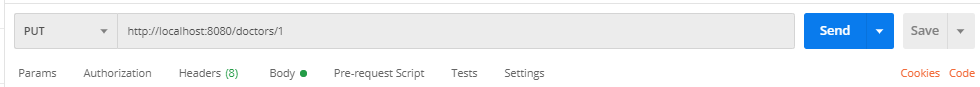

- Selecionando o usuario doctor/1
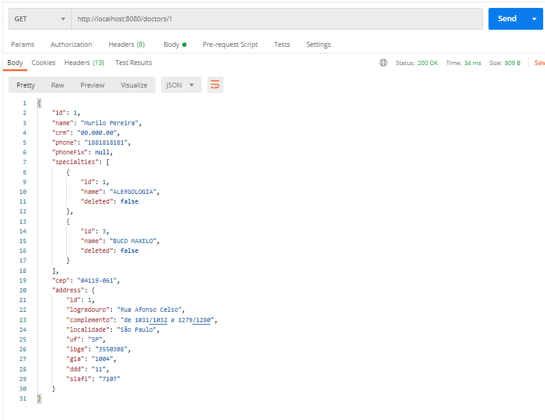

- Mudando para o metodo PUT e modificando informações para as seguintes
 ```sh
{
   "phone": "1881818181",
   "name": "Isadora Pereira",
   "cep": "04119061",
   "crm": "0026000",
   "specialties": [{ "id": 3}, { "id": 1 }]
}
```

- Doctor modificado
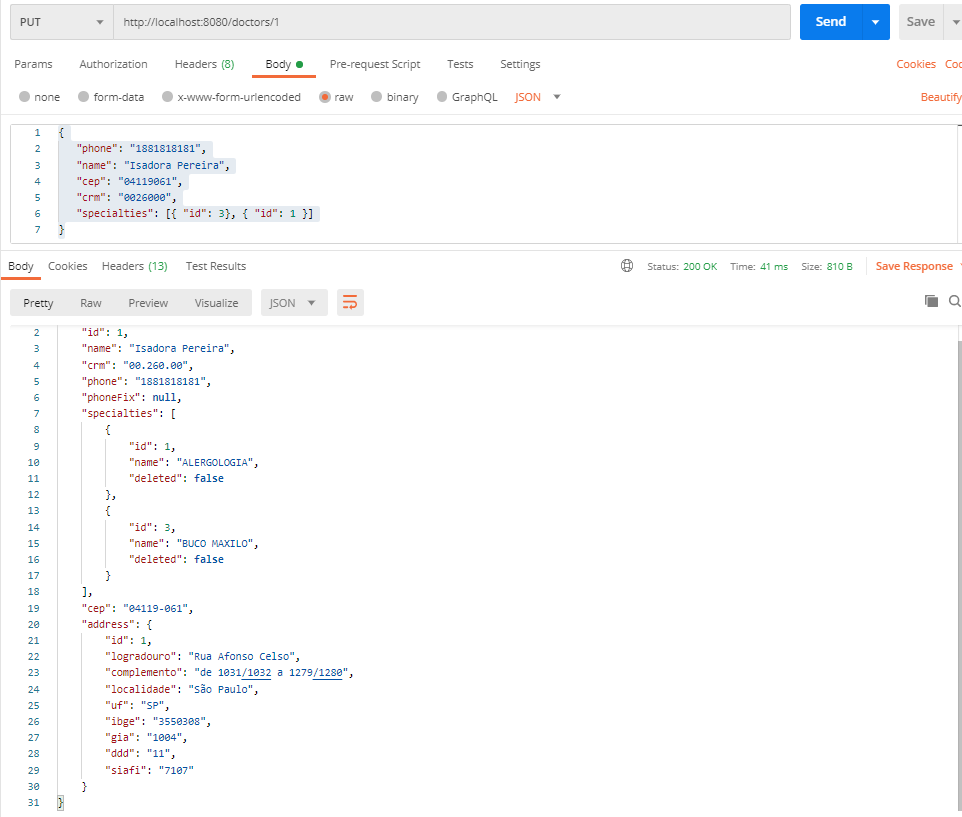

Implementações:
  - Usando parametros PUT por ID
  - Regras para modificação, caso CEP seja nulo, o que consta é o antigo, Caso crm seja nulo novamente, ele não faz insert nem update.


### Deletando Doctor

- Para deletar é necessario o metodo DELETE do HTTP, e o ID necessario.
- Requisitando DELETE doctors/1
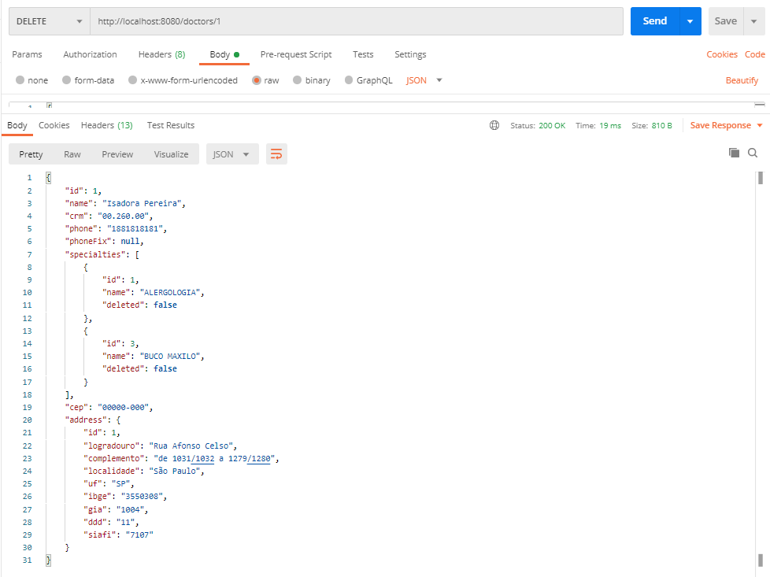
- Ao buscar novamente por ID = 1, ao enviar requisição note que ao clickar em SEND, a resposta é um 204 No Content, significa que foi deletaado com sucesso
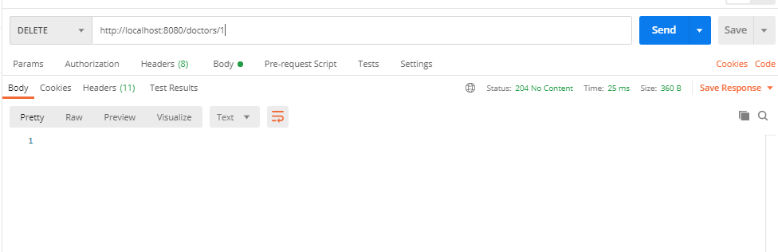


Implementações:
  - Usando regras compostas pra deletar Doctors com chaves estrangeiras.

#  Listando Specialties

- Foi criado um Controller para listar as especialidades, adicionar editar ou até mesmo deletar, para ter acesso a elas o controlador é chamado de /specialties

- Para listar é bem simples, basta enviar uma requisição para o metodo GET em /specialties
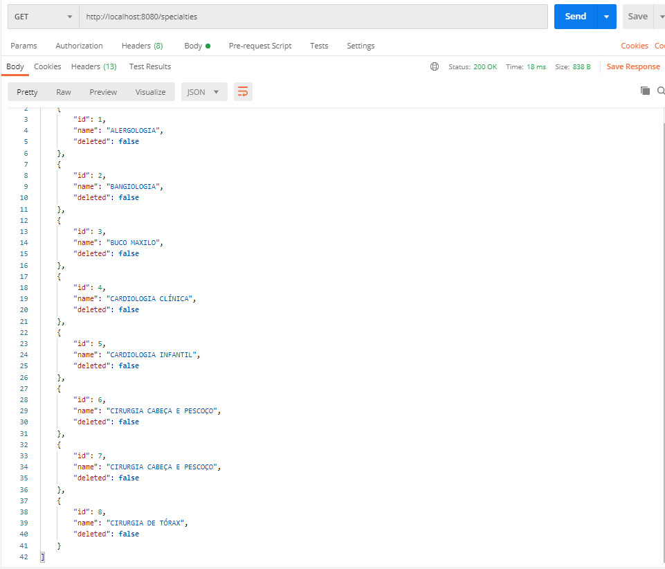

#  Editando Specialties

- A mesma coisa vai funcionar para editar, porém agora vamos mudar o metodo para PUT e passar o id de quem queremos modificar no caso /specialties/1
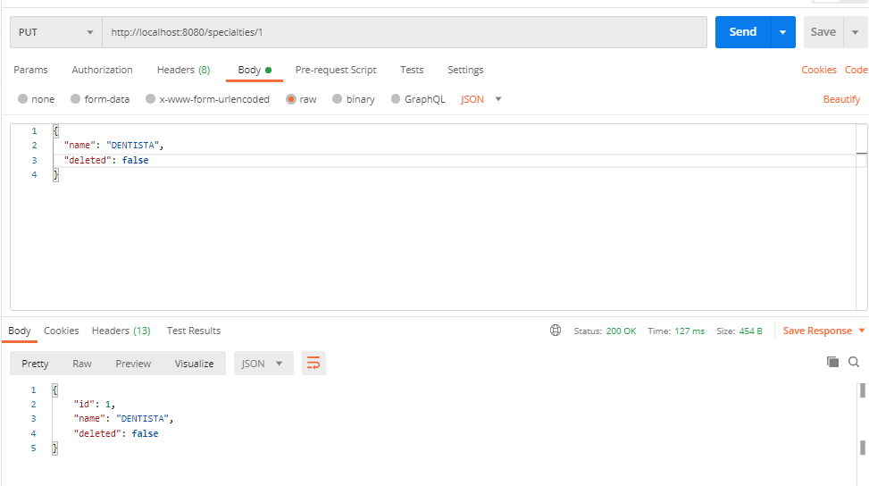
- Ao listar novamente nota-se que o elemento 1 foi modificado para dentista.
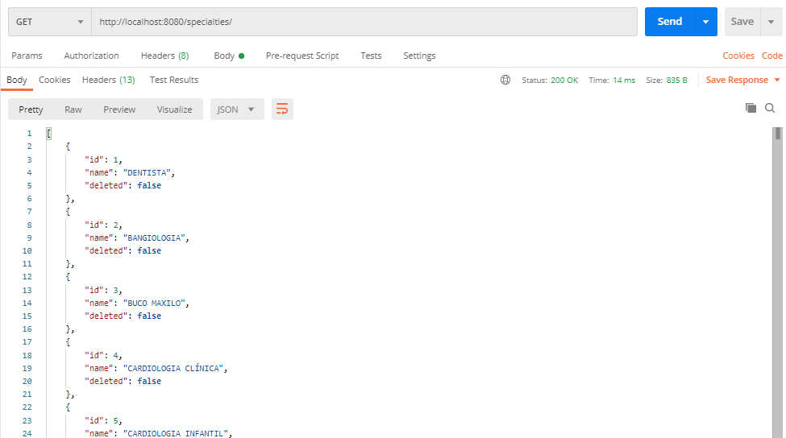

- OBS: PUT, POST, Sempre colocar no corpo Body() do Postman - Raw - JSON >


#  Deletando Specialties
- Para deletar como já vimos, modificamos o metodo para DELETE, vamos deletar o elemento 1 - Dentista
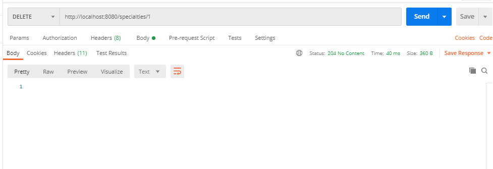
- 204 No Content é sinal de que foi deletado com sucesso, agora listando.
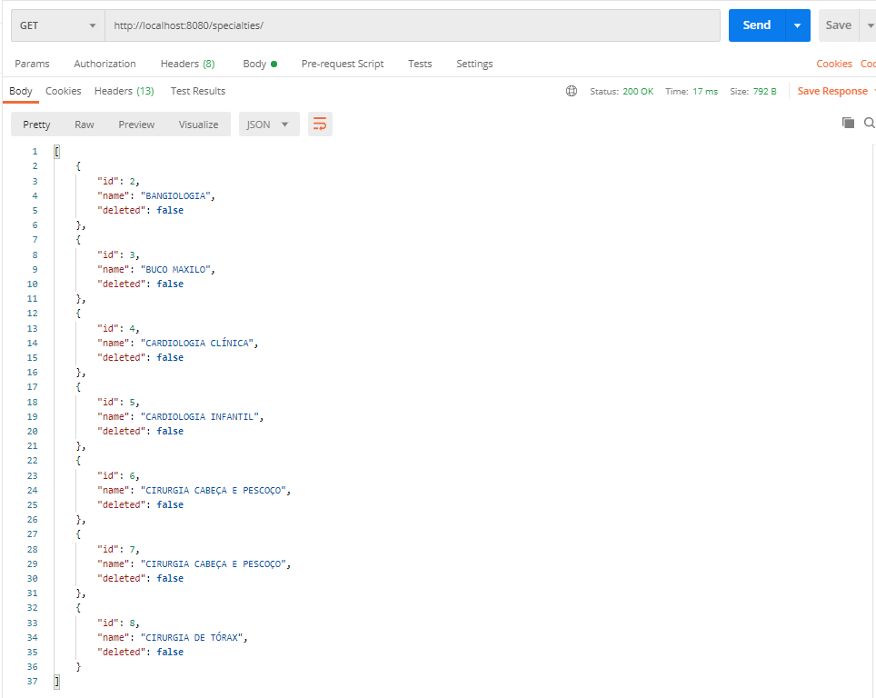

- Percebe que o id 1, Dentista não existe mais

- Implementações : No codigo tem varias regras de serviço para implementação ao banco, e integração.


- REGRAS DE ARQUIVOS UTILIZADOS.
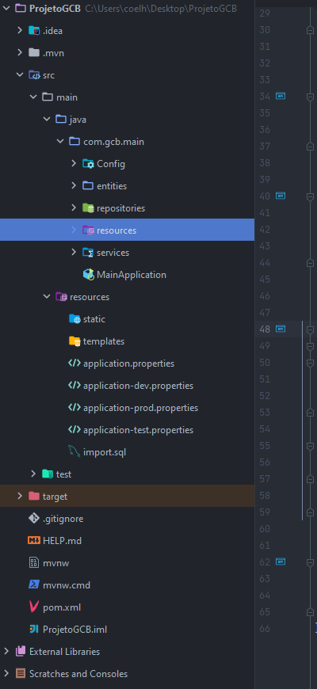
